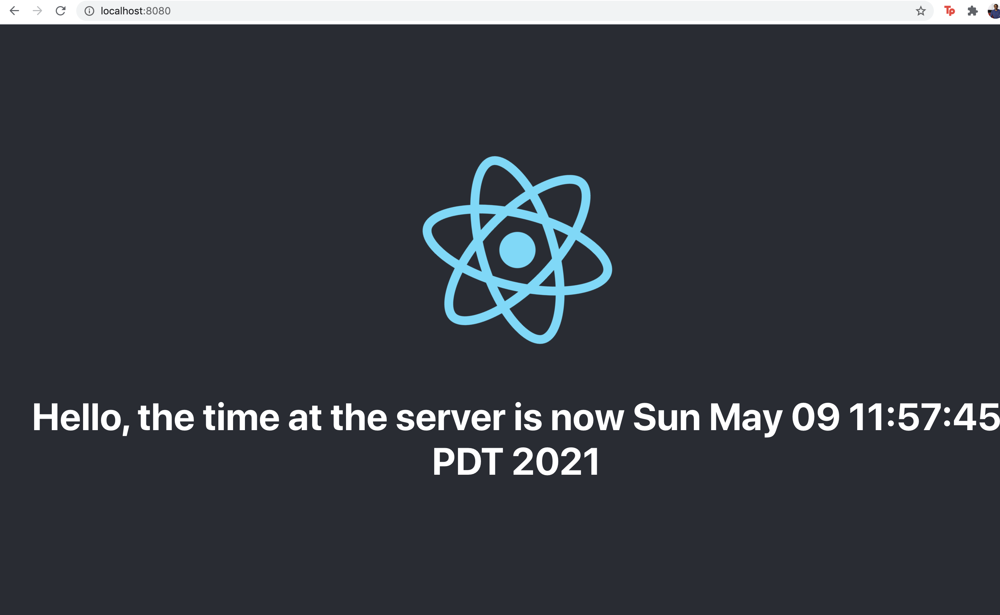

# Getting Started

Greatest Beverage
Congratulations! After years of tinkering with your secret recipe you have managed to create the world's greatest beverage. Inspired by some of the great modern day entrepreneurs, you have chosen to sell your beverage directly to consumers from your site. With an MVP perspective, you have chosen to ship a minimal set of features to start with the intention of improving the site based off of your customers' feedback.

Phase 1
Create a landing page that
 Tells the visitor what your drink is called
 Includes an image (or images) that has your drink in it.
 Describe the drink so everyone understands why it’s the greatest beverage ever.
 A privacy focused “pay me later” order form that contains the following:
 Customers name
 Quantity of drinks to purchase
 City
 State/Province
 Country
 An order button
After ordering
 Confirmation that the order succeeded
 Provide order confirmation number
 Provide unique URL to see order confirmation & details
Phase 1 Notes
Images can be your own or from the internet. A great site for public domain photos is Unsplash.
"pay me later" means you are not asking for any payment information.
Customers name should be optional, if the visitor does not supply one you should make up a name for them
Quantity of drinks to purchase should be optional, if the visitor does not supply an amount, you should decide the amount they are ordering
City, State/Province and Country are required
The order button can have any call to action text (button text) except "Order" or "Submit".
Keep your customers privacy in mind throughout the ordering process
Guidelines
This challenge is intended to take you a few hours of focused time.
Think of your submission as being code review request as part of the team. Submit code that you would like personally like to review.
We will be reviewing it from the perspective of you being a member of the team.
If there are steps that extend beyond what we have supplied in our sample templates, document it.
Your PR description will be read first. Include anything in there that you would like us to read. Decisions or tradeoffs that you made, document it.
What we look for
When we are reviewing your Pull Request, these are the areas we will be focusing on:

We care about code quality - Does it follow good coding practices & guidelines
We care about functionality - Does it do what it should do
We care about maintainability - Will this code be easy to maintain and build off of?
We care about performance - Is it fast?
We care about readability - Is it easy to understand?
We care about testing - Is it well tested?
We care about usability - Is it easy to use?

# Next Steps

* Install OpenJdk version 11 or higher
* Clone this project to $Home (Use any directory on your machine)
* `cd $Home/sliced_bread/demo_sonder` and then run `mvn clean install`
* Once the build is complete `cd $Home/sliced_bread/demo_sonder/sliced_bread/demo_sonder/target`
* Run `java -jar demo-0.0.1-SNAPSHOT.jar`
* Once the server is up and running go to `http://localhost:8080` and you should see the image below

### Reference Documentation
For further reference, please consider the following sections:

* [Official Apache Maven documentation](https://maven.apache.org/guides/index.html)
* [Spring Boot Maven Plugin Reference Guide](https://docs.spring.io/spring-boot/docs/2.4.5/maven-plugin/reference/html/)
* [Spring Web](https://docs.spring.io/spring-boot/docs/2.4.5/reference/htmlsingle/#boot-features-developing-web-applications)

### Guides
The following guides illustrate how to use some features concretely:

* [Building a RESTful Web Service](https://spring.io/guides/gs/rest-service/)
* [Serving Web Content with Spring MVC](https://spring.io/guides/gs/serving-web-content/)
* [Building REST services with Spring](https://spring.io/guides/tutorials/bookmarks/)

